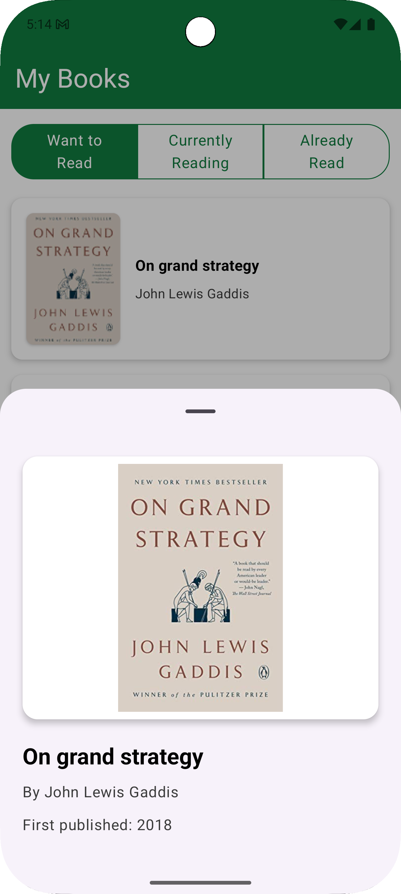

# MyBooks

## Project Overview

MyBooks is an Android application that displays a list of books from the OpenLibrary API. 

<table>
  <tr>
    <td></td>
    <td></td>
    <td></td>
  </tr>
</table>

 - The app demonstrates a robust implementation of the MVVM architecture and effective use of modern Android development technologies. 
 - The application allows users to browse different categories of books (Want to Read, Currently Reading, Already Read) in a scrollable list. 
 - Each book item displays the cover image, title, and author. 
 - Users can select a book to view more details in a bottom sheet.
 - The app also includes pagination to load more books as the user scrolls.

## Features

- Fetch book data from the OpenLibrary API
- Display books in a scrollable list with pagination
- Filter books by category (Want to Read, Currently Reading, Already Read)
- View book details in a bottom sheet
- Handle loading and error states
- Caching of book cover images

## Technologies Used

### Architecture
- **MVVM Architecture**: Clean separation of UI, business logic, and data layers
- **Package-by-Feature**: Organized with shared domain and data layers for better modularity
- **Clean Architecture**: Separation of concerns with domain, data, and presentation layers

### Libraries & Frameworks
- **Jetpack Compose**: Modern UI toolkit for building native UI
- **Hilt**: Dependency injection for better testability and maintainability
- **RxJava**: Reactive programming for handling asynchronous operations
- **Retrofit**: Type-safe HTTP client for API communication
- **Moshi**: JSON parsing library
- **Coil**: Image loading library with caching capabilities
- **Kotlin Flow**: For state management in the UI layer

## Technical Decisions

### Architecture
The application follows a clean architecture approach with three main layers:
- **Presentation Layer**: Compose UI components and ViewModels
- **Domain Layer**: Use cases, repository interfaces, and domain models
- **Data Layer**: Repository implementations, API services, and data models

- In a larger production application, the architecture would be fully modularized with separate modules for each feature and shared components.
- Data and Domain layers would also be pushed into their relevant feature modules where necessary.

### State Management
- Using Kotlin Flow for UI state management
- Comprehensive state handling for loading, error, and success states
- Pagination state management for infinite scrolling

### Dependency Injection
- Hilt for dependency injection throughout the application
- Modular DI setup with separate modules for different concerns (App, ImageLoader)

### Reactive Programming
- RxJava for handling asynchronous API calls
- Proper disposal of subscriptions to prevent memory leaks

### Image Loading
- Coil for efficient image loading with memory and disk caching
- Custom ImageLoader configuration for optimal performance

### Testing
- Unit tests were written for some of the main business logic

### Performance
- Consideration was given to ensuring long-running tasks are performed off the main thread
- Images sizes are chosen based on the UI component; medium for smaller list item images and large for book details view.

## Trade-offs

### Modularization
- The application uses a package-by-feature architecture rather than a fully modularized approach
- This was a conscious decision for a small demo app, but would be reconsidered for a larger application
- Benefits: Simpler build configuration, faster build times for a small app
- Drawbacks: Less enforced separation of concerns, potential for feature coupling

### UI Framework
- Jetpack Compose was chosen over obsolete XML layouts
- Benefits: More concise UI code, better state handling, easier to implement complex UIs

### Pagination
- Custom pagination implementation instead of using Paging library
- Benefits: Simpler implementation for this specific use case
- Drawbacks: Less robust than the Paging library for complex pagination scenarios

## Suggestions for Improvements

### Architecture
- Implement a fully modularized architecture for better scalability
- Treat Book Details bottom sheet as it's own screen and provide it's own ViewModel
- Share common code  or state handling across ViewModels/Repositories; to reduce duplicate and boilerplate code (BaseViewModel etc) 
- Add a local database for offline support using Room
- Implement a single source of truth pattern with repository mediators

### Testing
- Add comprehensive unit tests for ViewModels, use cases, and repositories
- Implement UI tests using Compose testing APIs
- Add integration tests for the data layer

### Potential Features
- Add search functionality
- Implement user authentication to access personal book lists
- Add book sorting and filtering options
- Implement book recommendations based on reading history
- Add dark/light theme support

### Performance
- Implement more sophisticated caching strategies
- Add performance monitoring using Firebase Performance
